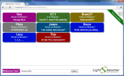

# Lightstreamer - Chat-Tile Demo - HTML (JQuery, Masonry) Client #

<!-- START DESCRIPTION lightstreamer-example-chattile-client-javascript -->

This project includes a web client front-end example for the [Lightstreamer - Chat-Tile Demo - Java Adapter](https://github.com/Weswit/Lightstreamer-example-ChatTile-adapter-java).

## Chat-Tile Demo ##

<table>
  <tr>
    <td style="text-align: left">
      &nbsp;<a href="http://demos.lightstreamer.com/ChatTileDemo" target="_blank"></a>&nbsp;
      
    </td>
    <td>
      &nbsp;An online demonstration is hosted on our servers at:<br>
      &nbsp;<a href="http://demos.lightstreamer.com/ChatTileDemo" target="_blank">http://demos.lightstreamer.com/ChatTileDemo</a>
    </td>
  </tr>
</table>

This <b>Chat-Tile Demo</b> implements a simple chat/collaborative application fed in real time via a Lightstreamer server.<br>
Once logged in, the user can start exchange messages with every other user present in the demo. For each user is created a tile of a specific background color, which contains the last message typed as well as the nickname chosen by the ueser and the user-agent information of the originating client.<br>
User messages are broadcasted as you type, character by character, to all other users.<br>

The demo includes the following client-side functionalities:
* A [Subscription](http://www.lightstreamer.com/docs/client_javascript_uni_api/Subscription.html) containing 1 item, subscribed to in <b>COMMAND</b> mode.
* The user messages are sent to the Lightstreamer Server using the [LightstreamerClient.sendMessage](http://www.lightstreamer.com/docs/client_javascript_uni_api/LightstreamerClient.html#sendMessage) utility.

<!-- END DESCRIPTION lightstreamer-example-chattile-client-javascript -->

# Deploy #

Before you can run the demo some dependencies need to be solved:

-  Get the lightstreamer.js file from the [latest Lightstreamer distribution](http://www.lightstreamer.com/download) 
   and put it in the src/js folder of the demo. Alternatively you can build a lightstreamer.js file from the 
   [online generator](http://www.lightstreamer.com/distros/Lightstreamer_Allegro-Presto-Vivace_5_1_1_Colosseo_20130305/Lightstreamer/DOCS-SDKs/sdk_client_javascript/tools/generator.html).
   In that case be sure to include the LightstreamerClient, Subscription, DynaGrid, and StatusWidget modules and to use the "Use AMD" version.
-  Get the require.js file form [requirejs.org](http://requirejs.org/docs/download.html) and put it in the src/[demo_name]/js folder of the demo.
-  Get the masonry.pkgd.min.js file form [Masonry - Cascading grid layout library - home page](http://masonry.desandro.com/) and put it in the src/js folder of the demo.

You can deploy this demo in order to use the Lightstreamer server as Web server or in any external Web Server you are running. 
If you choose the former case please note that in the <LS_HOME>/pages/demos/ folder there is a copy of the /src directory of this project, if this is non your case please create the folders <LS_HOME>/pages/demos/ChatTileDemo then copy here the contents of the /src folder of this project.<br>
The client demo configuration assumes that Lightstreamer Server, Lightstreamer Adapters and this client are launched on the same machine. If you need to targeting a different Lightstreamer server please search this line:
```js
var lsClient = new LightstreamerClient(null,"CHATTILE");
```
in js/lsClient.js file and change it accordingly (replace null with your server URI).<br>
Anyway the [Chat-Tile Demo Adapter](https://github.com/Weswit/Lightstreamer-example-ChatTile-adapter-java) have to be deployed in your local Lightstreamer server instance.
The demo is now ready to be launched.

# See Also #

## Lightstreamer Adapters needed by this demo client ##

<!-- START RELATED_ENTRIES -->
* [Lightstreamer - Chat-Tile Demo -  Java Adapter](https://github.com/Weswit/Lightstreamer-example-ChatTile-adapter-java)
* [Lightstreamer - Reusable Metadata Adapters - Java Adapter](https://github.com/Weswit/Lightstreamer-example-ReusableMetadata-adapter-java)

<!-- END RELATED_ENTRIES -->

## Similar demo clients that may interest you ##

* [Lightstreamer - Room-Ball Demo - HTML Client]()
* [Lightstreamer - Chat Demo - HTML Client](https://github.com/Weswit/Lightstreamer-example-Chat-client-javascript)
* [Lightstreamer - Round-Trip Demo - HTML Client](https://github.com/Weswit/Lightstreamer-example-RoundTrip-client-javascript)
* [Lightstreamer - Basic Messenger Demo - HTML Client](https://github.com/Weswit/Lightstreamer-example-Messenger-client-javascript)

# Lightstreamer Compatibility Notes #

- Compatible with Lightstreamer JavaScript Client library version 6.0 or newer.
