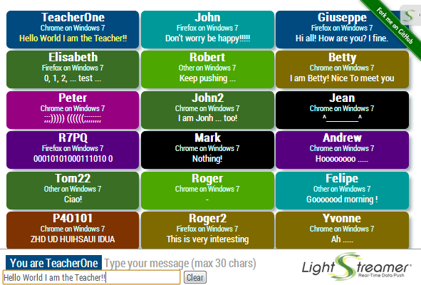

# Lightstreamer - Chat-Tile Demo - HTML (JQuery, Masonry) Client

<!-- START DESCRIPTION lightstreamer-example-chattile-client-javascript -->
The *Chat-Tile Demo* implements a simple chat/collaborative application based on [Lightstreamer](http://www.lightstreamer.com).

This project includes a web client front-end example for the [Lightstreamer - Chat-Tile Demo - Java Adapter](https://github.com/Lightstreamer/Lightstreamer-example-ChatTile-adapter-java).

## Live Demo
 

### [ View live demo](http://demos.lightstreamer.com/ChatTileDemo)

## Details

This *Chat-Tile Demo* implements a simple chat/collaborative application fed in real-time via a Lightstreamer server.
Once logged in, the user can start exchange messages with every other user present in the demo. For each user a tile of a specific background color is created, which contains the last message typed as well as the nickname chosen by the user and the user-agent information of the originating client. 
User messages are broadcasted as you type, character by character, to all other users.

The demo includes the following client-side functionalities:
* A [Subscription](https://lightstreamer.com/api/ls-web-client/latest/Subscription.html) containing 1 item, subscribed to in <b>COMMAND</b> mode.
* The user messages are sent to the Lightstreamer Server using the [LightstreamerClient.sendMessage](https://lightstreamer.com/api/ls-web-client/latest/LightstreamerClient.html#sendMessage) utility.

<!-- END DESCRIPTION lightstreamer-example-chattile-client-javascript -->

## Install
If you want to install a version of this demo pointing to your local Lightstreamer Server, follow these steps:
* As prerequisite, the [Lightstreamer - Chat-Tile Demo - Java Adapter](https://github.com/Lightstreamer/Lightstreamer-example-ChatTile-adapter-java) has to be deployed on your local Lightstreamer Server instance. Please check out that project and follow the installation instructions provided with it.
* Download this project.
* Get the `lightstreamer.js` file from [npm](https://www.npmjs.com/package/lightstreamer-client-web) or [unpkg](https://unpkg.com/lightstreamer-client-web/lightstreamer.js) and put it in the `src/js` folder of the demo.
  Alternatively, you can generate a customized lightstreamer.js library containing only the classes you actually use;
  see the build instructions on the [GitHub page](https://github.com/Lightstreamer/Lightstreamer-lib-client-javascript#building).
  In that case, be sure to include the LightstreamerClient, Subscription, DynaGrid, and StatusWidget modules and to use the "Use AMD" version.
* Get the `require.js` file from [requirejs.org](http://requirejs.org/docs/download.html) and put it in the `src/js` folder of the demo.
* Get the `masonry.pkgd.min.js` file from [Masonry - Cascading grid layout library - home page](http://masonry.desandro.com/) and put it in the `src/js` folder of the demo.
* Deploy this demo on the Lightstreamer Server (used as Web server) or in any external Web Server. If you choose the former, please note that in the `<LS_HOME>/pages/demos/` folder, there may be already a `ChatTileDemo` folder. If this is not your case, please create the folders `<LS_HOME>/pages/demos/ChatTileDemo` and copy here the contents of the `/src` folder of this project.
The client demo configuration assumes that Lightstreamer Server, Lightstreamer Adapters, and this client are launched on the same machine. If you need to target a different Lightstreamer server, please search in `js/lsClient.js` this line:  `var lsClient = new LightstreamerClient(null,"CHATTILE");`  and change it accordingly (replace null with your server URI).
* Open your browser and point it to: [http://localhost:8080/demos/ChatTileDemo/](http://localhost:8080/demos/ChatTileDemo/)

## See Also

### Lightstreamer Adapters Needed by This Client

<!-- START RELATED_ENTRIES -->
* [Lightstreamer - Chat-Tile Demo -  Java Adapter](https://github.com/Lightstreamer/Lightstreamer-example-ChatTile-adapter-java)
* [Lightstreamer - Reusable Metadata Adapters - Java Adapter](https://github.com/Lightstreamer/Lightstreamer-example-ReusableMetadata-adapter-java)

<!-- END RELATED_ENTRIES -->

### Related Projects

* [Lightstreamer - Room-Ball Demo - HTML Client](https://github.com/Lightstreamer/Lightstreamer-example-RoomBall-client-javascript)
* [Lightstreamer - Chat Demo - HTML Client](https://github.com/Lightstreamer/Lightstreamer-example-Chat-client-javascript)
* [Lightstreamer - Round-Trip Demo - HTML Client](https://github.com/Lightstreamer/Lightstreamer-example-RoundTrip-client-javascript)
* [Lightstreamer - Basic Messenger Demo - HTML Client](https://github.com/Lightstreamer/Lightstreamer-example-Messenger-client-javascript)

## Lightstreamer Compatibility Notes

- Compatible with Lightstreamer JavaScript Client library version 6.0 or newer.
